# Spotify Playlist Guard - Website

This project is a web app that provides an interface for interacting with the [Spotify Playlist Guard](https://github.com/marcus-castanho/spotify_playlist_guard). This app allows users to load their collaborative spotify playlists and configure allowed users to add and songs to the playlists which will not be removed from the guard bot.

## The application

This is the codebase of the web app for configuring spotify collaborative playlists of its users to be guarded from unauthorized editing. Links to the application:

-   The [application](https://spotify-playlist-guard-website.vercel.app/): the url to the live version of this project;
-   [Components storybook documentation](https://spotify-playlist-guard-website.vercel.app/): the url to the storybook docs for all the components used in the application;

Also, please check the **other apps related to this project**:

-   [Spotify Playlist Guard](https://github.com/marcus-castanho/spotify_playlist_guard): An application tha performs a guard routine periodically removing, from selected playlists, tracks added by unauthorized users;
-   [Spotify Playlist Guard API](https://github.com/marcus-castanho/spotify-playlist-guard-api): An API for the Spotify Playlist Guard application;

### Pages

#### Landing page - / (not authenticated)

A landing page with a hero section containing the guard bot logo, a brief description of the app and a button the redirects to the sign in page. The header is present across all the app and contains a version of the guard bot logo as a button that redirects back to the landing page or the home page if authenticated and a sun/moon button for witching between themes.

<div style="display:flex; gap:1rem">
    <div>
        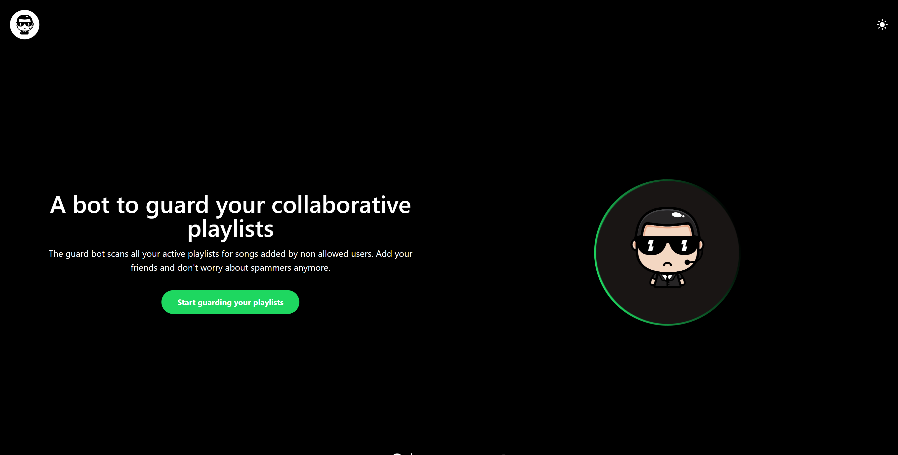
    </div>
    <div>
        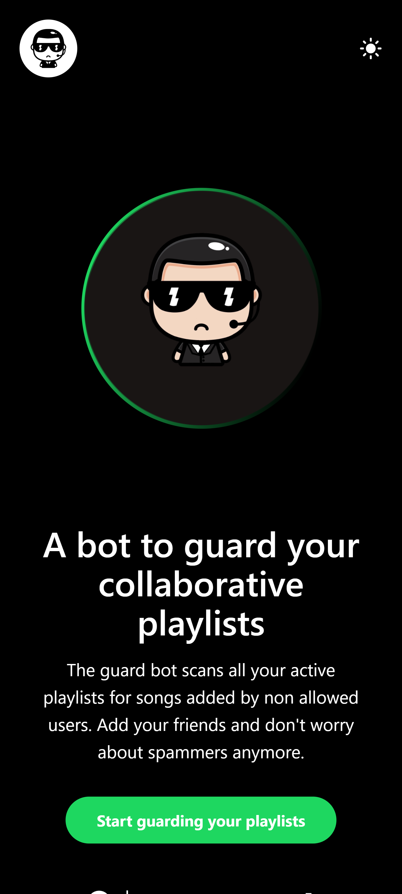
    </div>
</div>

#### Sign in page- /signin (not authenticated)

The sign in page contains a section with a button for signing in with spotify via OAuth2 authentication and a link that redirects to spotify's app so that the user can create a Spotify account. The footer is present in some pages accros the app and contains a Github logo which redirects to this app's repository and also a link to the developer's profile.

<div style="display:flex; gap:1rem">
    <div>
        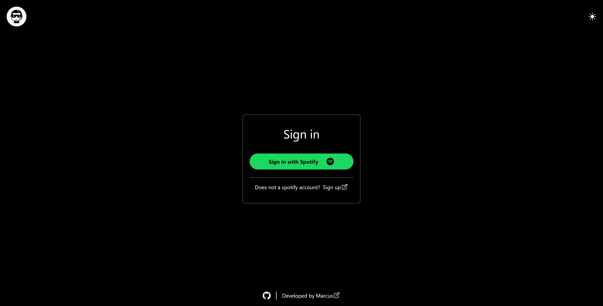
    </div>
    <div>
        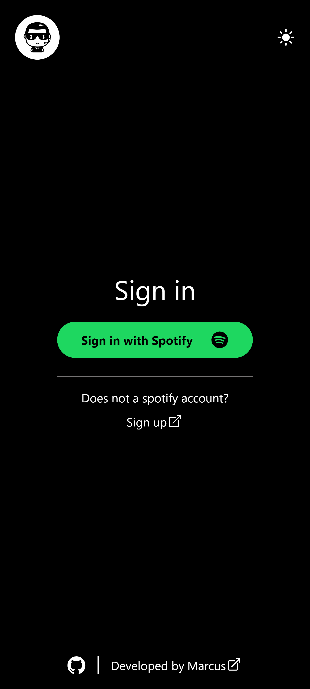
    </div>
</div>

#### Home page - / (authenticated)

The home page for authenticated users shows a section containing a maximum of 5 cards for the user's spotify playlists. Each card presents a pencil button that leads to the playlist page and a toggle button to turn the guard bot routine on or off for the playlist. The card also shows the playlist image or a default image, name, number of allowed users and status - collaborative or not collaborative (only collaborative playlists can be turned on with the toggle button). The playlists section is paginated with a maximum of 5 playlists per page and a pagination bar ath the bottom with previous and next button as well as the current page and other available pages. The header for authenticated pages also contains a profile image which opens a pop-up container with options of redirection to the profile page or signin out.

<div align="center">
  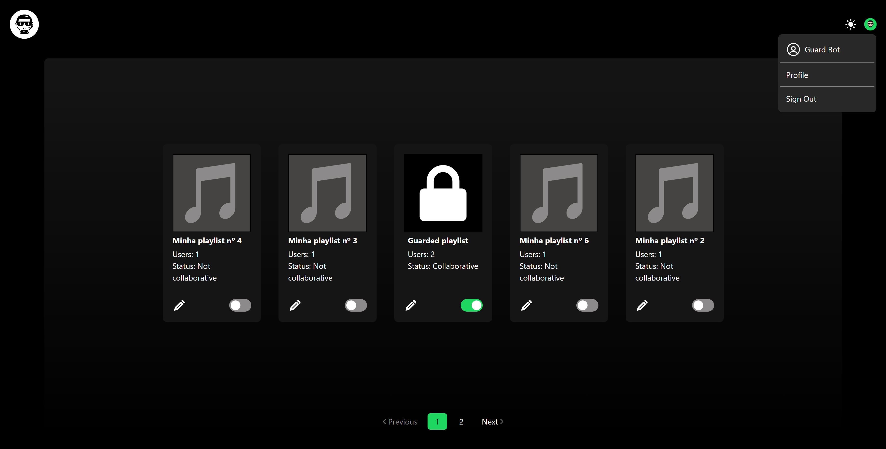
</div>
<div style="display:flex; gap:1rem">
    <div>
      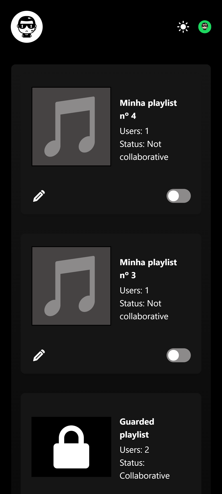
    </div>
    <div>
      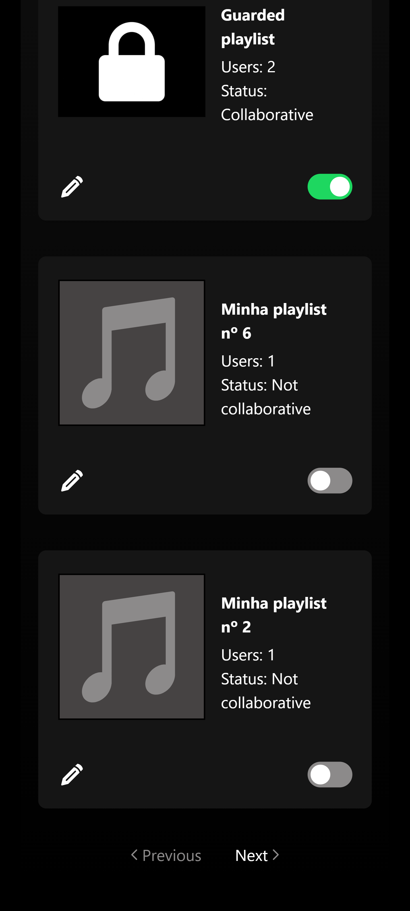
    </div>
    <div>
      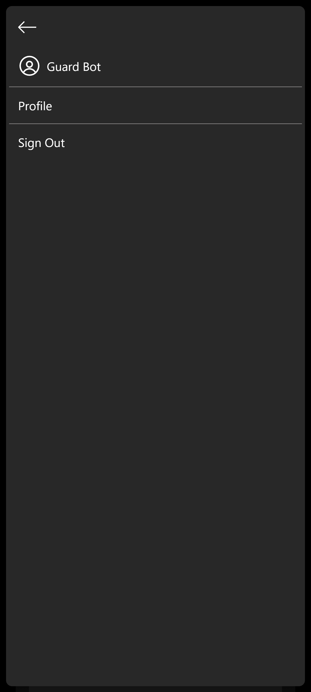
    </div>
</div>

#### Profile page - /profile (authenticated)

The profile page presents a center section containing the user's spotify profile picture their info: name and e-amil.

<div style="display:flex; gap:1rem">
    <div>
        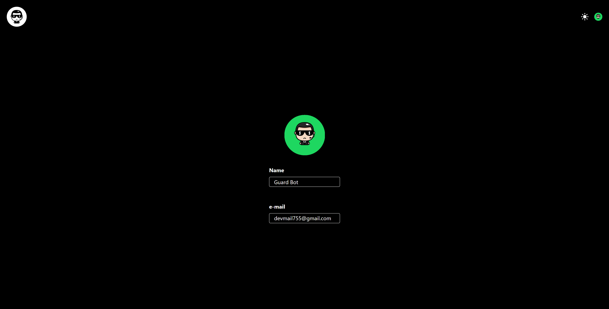
    </div>
    <div>
        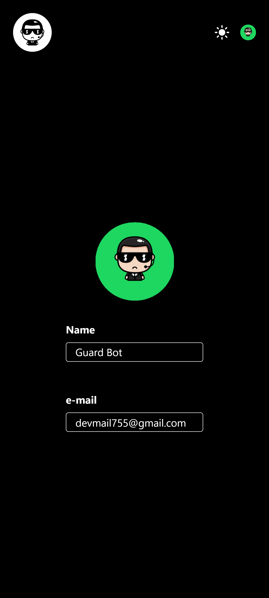
    </div>
</div>

#### Playlist page - /playlist (authenticated)

The playlist presents an interface for searching spotify users, adding users and removing users. The interface is divided between to sections. The first section contains a search bar for searching spotify users at the top, a section for manually entering a user's id for when the search result does not present the exact user and a list of the search results. The users search result presents the user spotify profile picture, name and its status, which can be 'Added', 'Removed' or idle, in which case, an icon of a plus sign button is habilitated. The second section presents the playlist owner at the top, which can not be removed from the users list, followed by the list of other users allowed to add songs to the playlist. Each user contains their profile picture, name and status: "Added" for recently added users, "Removed" for recently removed users and idle. A trash icon button is habilitated when the user has the "Added" or idle status. A restore icon button is habilitated when the user has been recently added or removed. At the bottom of the section is a button to save the editing status.

<div style="display:flex; gap:1rem">
    <div>
        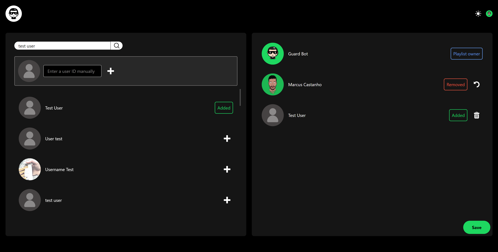
    </div>
    <div>
        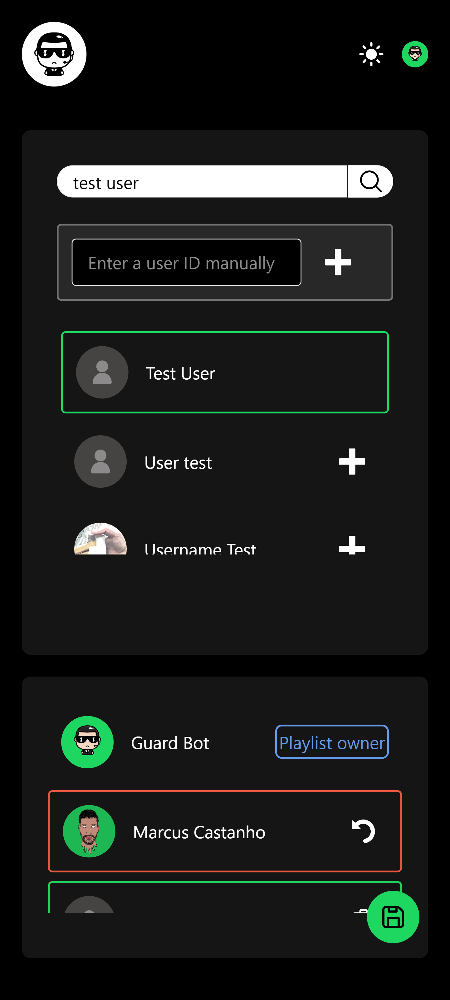
    </div>
</div>

### Authentication

This projects uses three strategies for authentication of its users and clients: OAuth2, JWT. For more information on how the autentication service works in the back end, please see the ["Authentication" section in the API documentation](https://github.com/marcus-castanho/spotify-playlist-guard-api?tab=readme-ov-file#authentication).

### Architecture

This project uses the [Next.js](https://nextjs.org/) framework, and, therefore, uses its routes based architecture (page folder router) with each file in the page folder representing a page route. For more information, please check out [Next.js official documentation](https://nextjs.org/docs/pages). Also, all the application is contained in the `/src` folder and is mainly divided between pages in `/pages` folder, components in `/components` folder, tests in `/tests` folder and other folders that represent other tools, services and adapters that are used in the pages.

### Technologies and libraries

-   [TypeScript](https://www.typescriptlang.org/) as language;
-   [Next.js](https://nextjs.org/) as framework;
-   [React](https://react.dev/) as web UI library;
-   [Tailwind](https://tailwindcss.com/) as CSS framework;
-   [Storybook](https://storybook.js.org/) as documentation tool;
-   [GitHub Actions](https://github.com/features/actions) as CI/CD tool;
-   [Vercel](https://vercel.com/) as cloud server host;

## Usage:

Requirements:

-   An instance of [Spotify Playlist Guard API](https://github.com/marcus-castanho/spotify-playlist-guard-api) running;
-   [NodeJS and npm](https://nodejs.org/en/) installed in your machine;
-   A terminal of your choice.

Steps:

1. Clone this repo on your local directory;
2. In the terminal, enter the created directory and run the following command to install all the dependencies:

```
npm install -y
```

3. Create a .env file based on the .env.example in this project and insert the values of the vars based on your development environment.

4. Run the following command to run the app in development mode:

```
npm run dev
```

5. For a production-like running app, run the following commands:

```
npm run build
```

```
npm run start
```

The application will then be available at 'http://localhost:8080'

# Development and contributions

## Commit Message Guidelines

This project uses [Convention Commit](https://www.conventionalcommits.org/) with [ AngularJS's commit message convention](https://github.com/angular/angular.js/blob/master/DEVELOPERS.md#-git-commit-guidelines) specifications for standard commit messages.

## Git Hooks

Git hooks compliant with the commit guidelines and linting of the projet are defined in the ./husky folder. The hooks are disabled by default and can be enabled or disabled using the commands:

```
npm run enable-hooks
```

```
npm run disable-hooks
```

## License

Spotify Playlist Guard Website is published under [MIT license](https://github.com/marcus-castanho/spotify_playlist_guard/blob/main/LICENSE)
